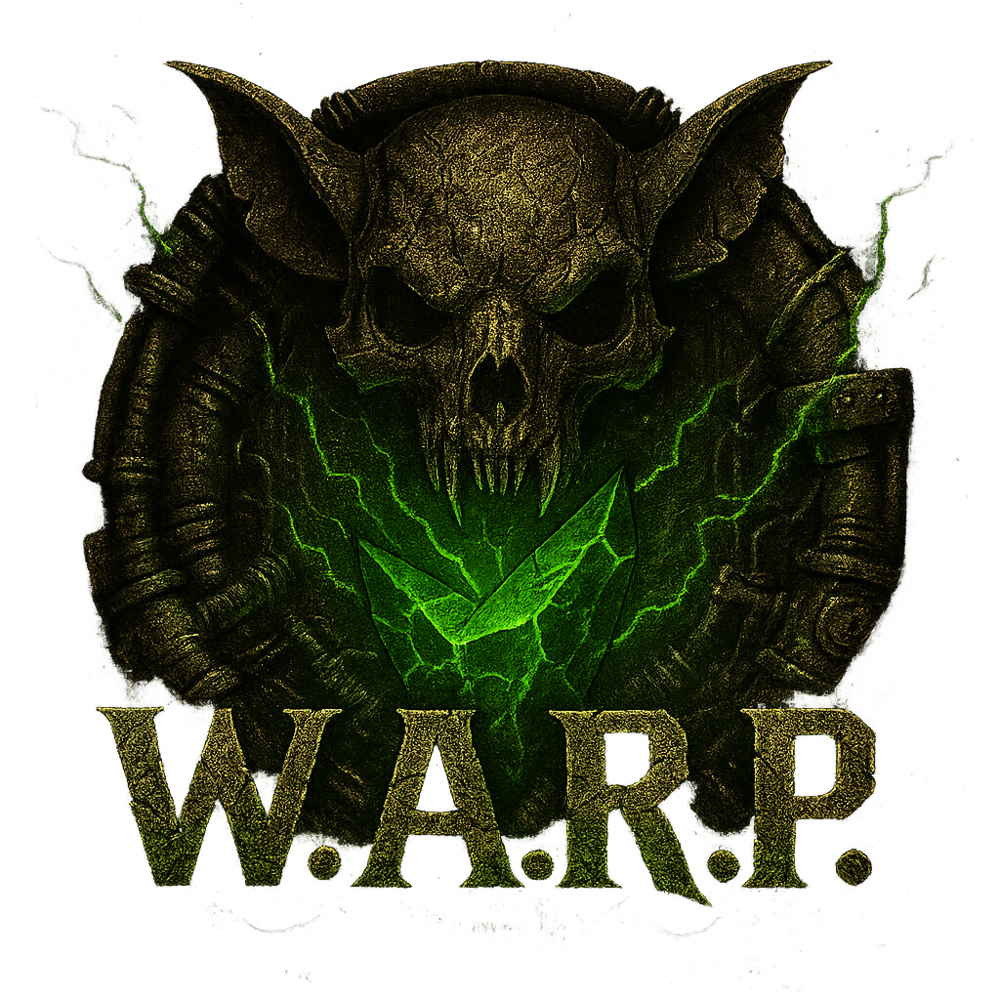
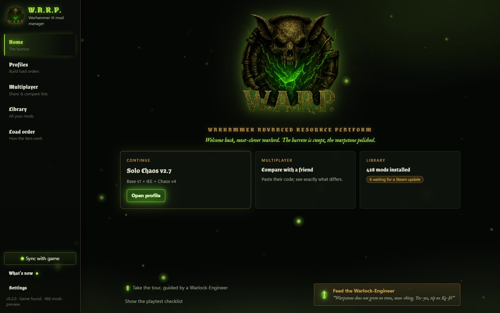
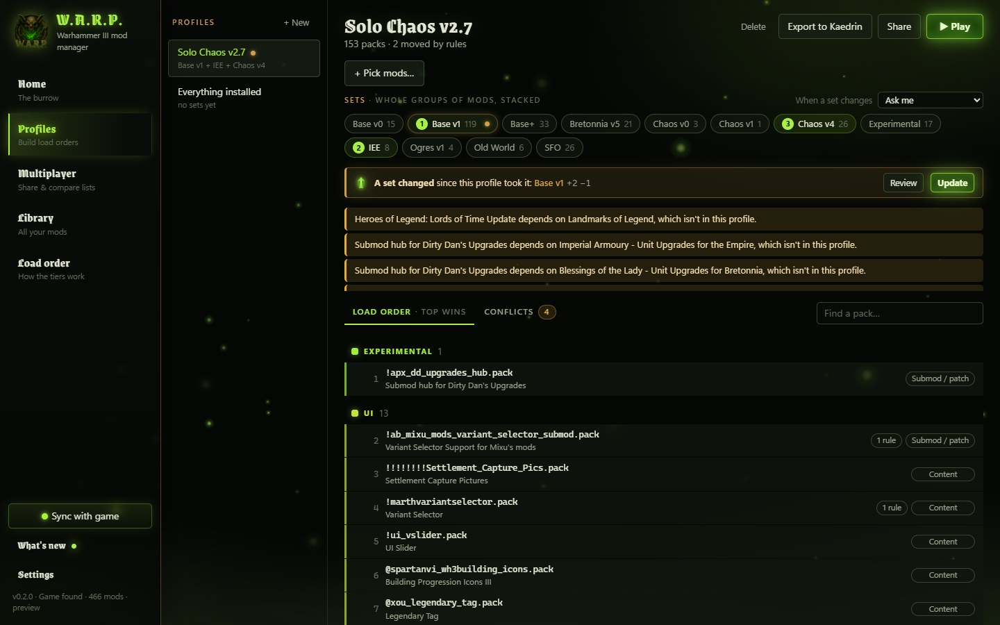
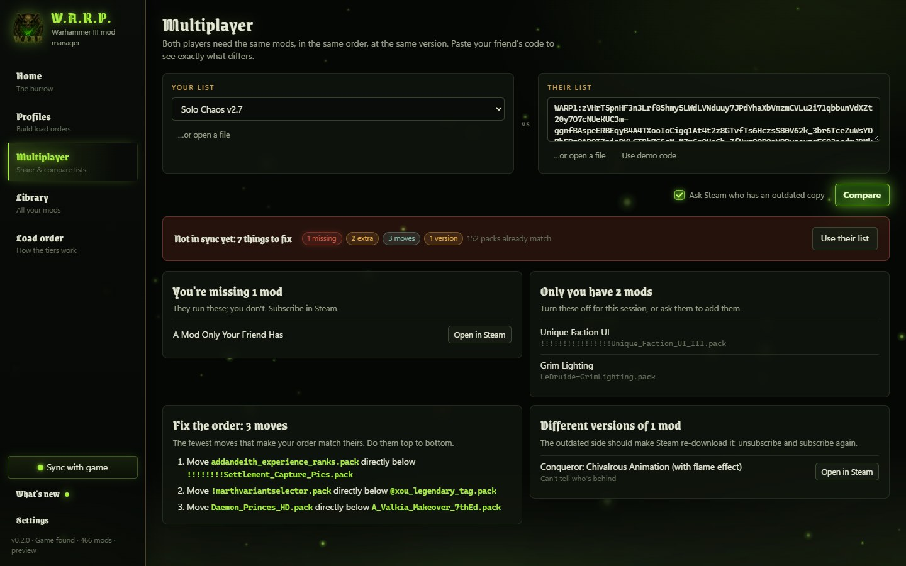
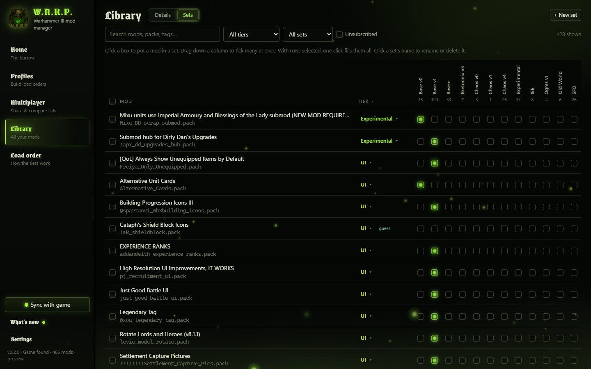
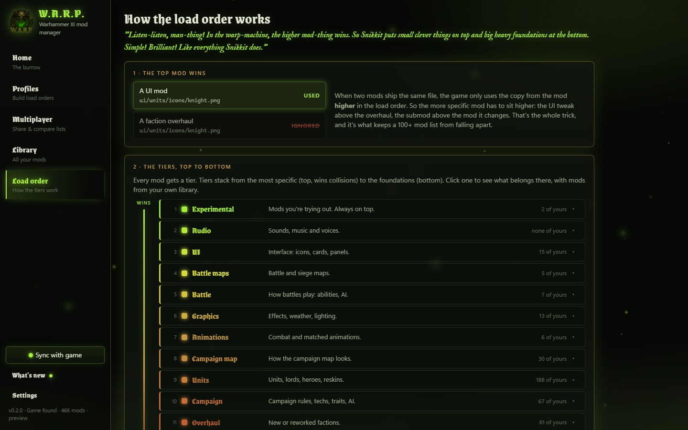

<p align="center">
  
</p>

<h1 align="center">W.A.R.P.</h1>

<p align="center">
  <b>Warhammer Advanced Resource Platform</b><br>
  A mod manager for <b>Total War: WARHAMMER III</b> that works out your load order for you,<br>
  and gets you and your friends into multiplayer with matching mod lists.
</p>

<p align="center">
  
  
  
  
</p>

<p align="center">
  <a href="#what-it-does">What it does</a> ·
  <a href="#install">Install</a> ·
  <a href="#what-it-touches-on-your-pc">What it touches on your PC</a> ·
  <a href="#building-from-source">Building from source</a>
</p>

> *"Listen-listen, man-thing! In the warp-machine, the higher mod-thing wins. So Snikkit puts small clever things
> on top and big heavy foundations at the bottom. Simple! Brilliant!"*
> Warlock-Engineer Snikkit, your guide in the app



## What it does

### Orders mods by what they are

When two mods change the same file, the game uses the one higher in the load order. W.A.R.P. gives every mod a
**tier**: specific mods (UI, submods, patches) go on top, and big foundations (overhauls, frameworks, assets) sit
underneath. Hard rules apply on top of that: a mod that needs or patches another goes above it. Every placement
tells you *why* it's there, and a conflict map shows which mods fight over which files.

Mods the community list doesn't know yet get a tier guessed from what's inside their packs. Hover "guess" to see why.



### Multiplayer without the headache

Share your list as a short code that fits in one Discord message. Paste a friend's code and W.A.R.P. tells you
exactly what's missing, what's extra, the fewest moves to fix the order, and whose copy of a mod is outdated
(it asks Steam).



### Sets and profiles

Build reusable **sets** (Base, SFO, one per campaign...) by ticking mods into set columns in the Library, or drag
down a column to tick many at once. A **profile** stacks sets plus single mods. It keeps its own copy of each set,
so changing a set later never changes a profile behind your back: the profile asks first.



### Explains itself

A Load order page shows how the tiers work, with your own mods in each tier. The tier picker has hints, and a
short tour by Snikkit walks you through the app.



### And also

- **Crash suspects after a game update:** mods that were kept up to date for the previous update but haven't been
  updated since the latest one (9.0 right now) get a flag on the load order and in the Library, and a profile warning
  can leave them all out in one click.
- **Play** writes the mod list and starts the game directly. CA's launcher isn't needed.
- **Kaedrin's Mod Manager:** open one of its profiles to compare against, or export a W.A.R.P. profile to it.
- **Your lists are safe:** a backup at every start (the last seven are kept), a database check before use, and an
  offer to restore a backup if the database is ever damaged or suddenly empty.
- **Community knowledge:** mod tiers and relations, and the list of game updates that break mods, live in a shared
  knowledge base ([knowledge/](knowledge/)), so nobody has to tag 400 mods alone.

## Install

For the **Steam version** of WARHAMMER III, on Windows 10 or 11.

1. Download the latest installer from [Releases](https://github.com/Stigsmith/W.A.R.P./releases).
2. Run it. It installs for your user only; no admin rights needed.
3. The installer isn't code-signed yet, so Windows SmartScreen may warn you. Choose **More info**, then
   **Run anyway**. Don't want to trust a stranger's installer? Fair: read the source and build it yourself (below).

## What it touches on your PC

W.A.R.P. is built so you can check exactly what it does. In short:

| Where | What |
|---|---|
| The game folder | Writes `warp_mods.txt` (your mod list, rewritten each time you press Play) and `steam_appid.txt` (lets the game start without going through CA's launcher). |
| `%APPDATA%\WARP` | Its own data: `warp.db` (your sets and profiles), `backups\` and `warp.log`. |
| `%APPDATA%\Kaedrin Mod Manager` | Only when you click **Export to Kaedrin**, after asking: writes that one profile. |
| Steam's folders | Reads only: where the game is, which Workshop mods are installed, and what's inside their packs. |
| The internet | Only Steam's public Workshop API, to look up mod titles and update times by their Workshop IDs. No accounts, no tracking, no telemetry. |

It never changes CA's launcher settings or `used_mods.txt`, never edits a pack, and never subscribes or
unsubscribes you: for that it opens the mod's Steam page.

The code for this lives in [`launch.rs`](crates/warp-core/src/launch.rs), [`install.rs`](crates/warp-core/src/install.rs)
and [`steam.rs`](crates/warp-core/src/steam.rs).

## Building from source

Needs Rust 1.90+ and Node 20+. On Windows, also the Visual Studio C++ Build Tools.

```sh
cargo test --workspace                # core tests
cargo run -p warp-cli -- --help       # the command-line tool
npm --prefix app install
npm --prefix app run tauri dev        # the desktop app
npm --prefix app run release         # the installer, with your folder paths stripped
```

Checks run locally before every commit (format, lints, tests, UI types, changelog). Turn them on once per clone:

```sh
git config core.hooksPath .githooks
```

| Path | What |
|---|---|
| `crates/warp-core` | All the logic: load-order solver, multiplayer, knowledge, storage, Steam |
| `crates/warp-cli` | The `warp` command-line tool |
| `app/` | The desktop app (Tauri 2 + Svelte 5) |
| `knowledge/` | The tier taxonomy and the community knowledge base |
| `docs/` | How things work: [architecture](docs/architecture.md), [load order](docs/load-order.md) |

## Feedback and support

Found a bug or a mod in the wrong tier? [Open an issue](https://github.com/Stigsmith/W.A.R.P./issues). In the app,
**Settings → Copy report** puts everything useful on your clipboard.

If W.A.R.P. saves you an evening of load-order bisecting, you can
[feed the Warlock-Engineer on Ko-fi](https://ko-fi.com/stigsmith).

## Licence

[MIT](LICENSE). W.A.R.P. is a fan project, not affiliated with or endorsed by Creative Assembly, SEGA or Games
Workshop. Warhammer and Total War are trademarks of their owners.
